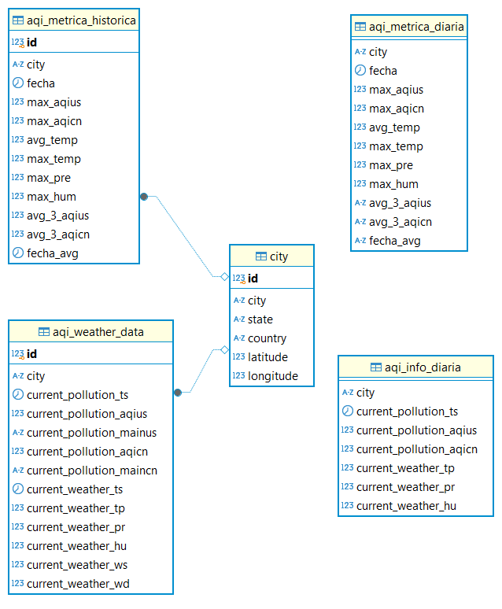

# ETL - AQI - Argentina 

## Introducción

El proyecto es un ETL que se comporta de la siguiente forma:

- Extract (E): Se obtiene información específica de ciudades argentinas, con su contaminación y clima actual, consultando una API de la siguiente forma 
 
```https
  GET api.airvisual.com/v2/city?
```

| Parameter | Type     | Description                |
| :-------- | :------- | :------------------------- |
| `api_key` | `string` | **Required** |
| `city` | `string` | **Required** |
| `state` | `string` | **Required** |
| `country` | `string` | **Required** |

- Transform (T): La información extraída es transformada mediante funciones de Pandas y query SQL, utilizando archivos parquet para almacenar archivos intermedios.

- Load (L): La información transformada es persistida en una base de datos redshift.


## Ejecutar Airflow localmente :computer:

#### Requisitos
 - Tener instalado Python 3.10.12 

#### Implementación

Desde la terminal clonar el repositorio

```bash
  git clone https://github.com/ingmarianogomez/etl_aqi_argentina.git
```

Ingresar al directorio del proyecto

```bash
  cd etl_aqi_argentina
```

Crear un entorno virtual

```bash
  python -m venv venv
  source venv/bin/activate
```

Establecer como variables de entorno las contraseñas compartidas por privado

`API_KEY`
`REDSHIFT_PASSWORD`

Instalar las dependencias

```bash
  pip install -r requirements.txt
```

Para iniciar la base de datos, configurar el entorno y arrancar tanto el servidor web como el scheduler ejecutar

```bash
   export PYTHONPATH=$(pwd)
   AIRFLOW_HOME=$(pwd) airflow standalone
```

## Ejecutar Airflow mediante Docker :whale:

#### Requisitos
 - Tener instalado Docker Desktop 

#### Implementación

Desde la terminal clonar el repositorio

```bash
  git clone https://github.com/ingmarianogomez/etl_aqi_argentina.git
```

Ingresar al directorio del proyecto

```bash
  cd etl_aqi_argentina
```

Almacenar en una variable el ID de usuario actual y creación de carpetas necesarias

```bash
  mkdir -p ./logs ./plugins ./config
  echo -e "AIRFLOW_UID=$(id -u)" > .env
```
En el archivo .env creado se deberan agregar la `API_KEY` y la `REDSHIFT_PASSWORD`


Inicio de la base de datos

```bash
  docker compose up airflow-init
```

Correr Airflow

```bash
  docker compose up
```

## Modelo de Datos

Este proyecto utiliza las siguientes tablas para almacenar y organizar la información.

### Diagrama del Modelo de Datos


### Tabla: `city`

Descripción: Almacena la información de las ciudades que se van a consultar.

| Nombre del Campo | Tipo de Dato    | Descripción                                |
|------------------|-----------------|--------------------------------------------|
| id              | int4| Identificador único de la ciudad|
| city            | varchar(100) | Nombre de Ciudad |
| state            | varchar(100) | Nombre de Estado/Provincia |
| country            | varchar(100) | Nombre de País |
| latitude           | float8    | Coordenada geográfica Latitud de la ciudad |
| longitude      | float8       | Coordenada geográfica Latitud de la ciudad |

### Tabla: `aqi_weather_data`

Descripción: Se almacena la información resultante de las llamadas a la API, con los parámetros obtenidos de la tabla city. 

| Nombre del Campo | Tipo de Dato    | Descripción                                |
|------------------|-----------------|--------------------------------------------|
| id              | int4| Identificador único de registro             |
| city            | varchar(100)- FK (city.city)  | Ciudad sobre cuál son las mediciones |
| current_pollution_ts           | TIMESTAMP    | Timestamp de la medición de la pollution |
| current_pollution_aqius      | float8       | Valor de AQI según standard USA |
| current_pollution_mainus      | varchar(10)       | Mayor contaminante según standar USA |
| current_pollution_aqicn      | float8       | Valor de AQI segun standar CHINA   |
| current_pollution_maincn      | varchar(10)       | Mayor contaminante según standar CHINA |
| current_weather_ts           | TIMESTAMP    | Timestamp de la medicion del clima   |
| current_weather_tp      | float8       | Temperatura en grados Celsius |
| current_weather_pr      | float8       | Presión atmosférica en hPa  |
| current_weather_hu      | float8       | Porcentaje de humedad |
| current_weather_ws     | float8       | Velocidad del viento en m/s |
| current_weather_wd      | float8       | Dirección del viento en ángulo 360° (N=0, E=90, S=180, W=270) |

### Tabla: `aqi_info_diaria`

Descripción: Esta tabla tiene registros obtenidos de la tabla aqi_weather_data y procesados, garantizandonos que sea información única, diaria y los campos necesarios para hacer un seguimiento de los índices AQI.

| Nombre del Campo | Tipo de Dato    | Descripción                                |
|------------------|-----------------|--------------------------------------------|
| id              | int4| Identificador único de registro             |
| city            | varchar(100)- FK (city.city)  | Ciudad sobre cuál son las mediciones |
| current_pollution_ts           | TIMESTAMP    | Timestamp de la medición de la pollution |
| current_pollution_aqius      | float8       | Valor de AQI según standar USA |
| current_pollution_aqicn      | float8       | Valor de AQI segun standar CHINA   |
| current_weather_tp      | float8       | Temperatura en grados Celsius |
| current_weather_pr      | float8       | Presión atmosférica en hPa  |
| current_weather_hu      | float8       | Porcentaje de humedad |

### Tabla: `aqi_metrica_diaria`

Descripción: En esta tabla se muestran los valores máximos del dia de los distintos indicadores para cada ciudad calculados desde aqi_info_diaria. También se obtiene de la tabla aqi_metrica_historica un promedio de los máximos AQI de los últimos 3 dias para cada ciudad.

| Nombre del Campo | Tipo de Dato    | Descripción                                |
|------------------|-----------------|--------------------------------------------|
| id              | int4| Identificador único de registro             |
| city            | varchar(100)- FK (city.city)  | Ciudad sobre cuál son las mediciones |
| fecha            | date  | Fecha de las métricas obtenidas |
| max_aqius            | float8  | Maximo indice AQIUS del dia vigente |
| max_aqicn            | float8  | Maximo indice AQICN del dia vigente |
| avg_temp             | float8  | Temperatura promedio del día vigente en grados Celsius |
| max_temp            | float8  | Temperatura Máxima del dia vigente en grados Celsius |
| max_pre            | float8  | Máxima Presión del dia vigente en hPa|
| max_hum            | float8  | Maximo Porcentaje de humedad del dia vigente |
| avg_3_aqius            | varchar(256)  | Promedio de los Máximos índices AQIUS de los últimos 3 dias |
| avg_3_aqicn           | varchar(256)  | Promedio de los Maximos indices AQICN de los ultimos 3 dias |
| fecha_avg            | varchar(256)  | Fecha del registro más antiguo para calcular el promedio de los últimos 3 dias|

### Tabla: `aqi_metrica_historica`

Descripción: En esta tabla se van almacenando una vez por dia los registros de la tabla aqi_metrica_diaria. Necesario para poder llevar un registro histórico de los Máximos como para el cálculo de los promedios a comparar también en la tabla aqi_metrica_diaria.

| Nombre del Campo | Tipo de Dato    | Descripción                                |
|------------------|-----------------|--------------------------------------------|
| id              | int4| Identificador único de registro             |
| city            | varchar(100)- FK (city.city)  | Ciudad sobre cuál son las mediciones |
| fecha            | date  | Fecha de las métricas obtenidas |
| max_aqius            | float8  | Maximo indice AQIUS del dia vigente |
| max_aqicn            | float8  | Maximo indice AQICN del dia vigente |
| avg_temp             | float8  | Temperatura promedio del día vigente en grados Celsius |
| max_temp            | float8  | Temperatura Máxima del dia vigente en grados Celsius |
| max_pre            | float8  | Máxima Presión del dia vigente en hPa|
| max_hum            | float8  | Maximo Porcentaje de humedad del dia vigente |
| avg_3_aqius            | varchar(256)  | Promedio de los Máximos índices AQIUS de los últimos 3 dias |
| avg_3_aqicn           | varchar(256)  | Promedio de los Maximos indices AQICN de los ultimos 3 dias |
| fecha_avg            | varchar(256)  | Fecha del registro más antiguo para calcular el promedio de los últimos 3 dias|

## Carga de datos Inicial

#### Carga de datos en la tabla city

En caso de tener que popular la tabla city, copiar la consulta que se encuentra en `SQL/3_insert_into_city.SQL` y ejecutarla desde un cliente donde se encuentre la base de datos conectada.